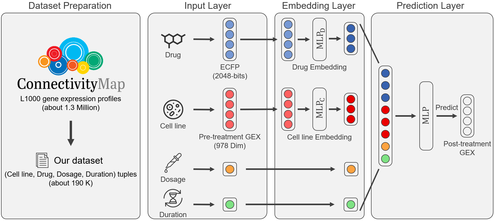
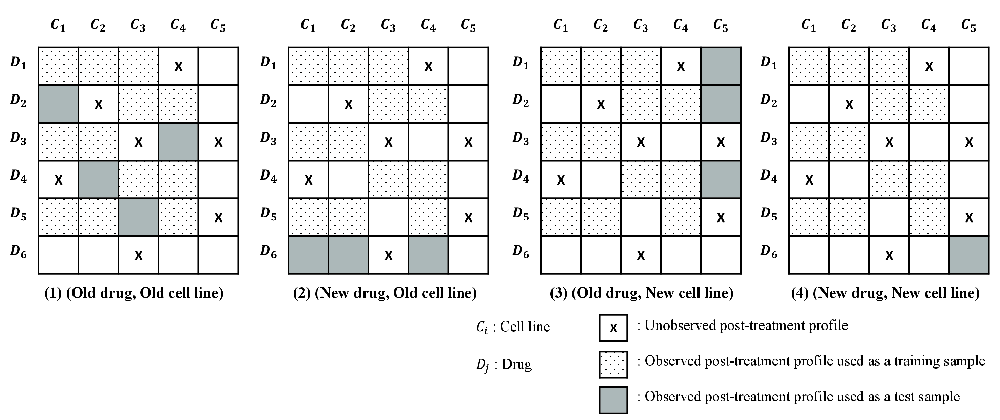

# TRNet

This repository provides implementation code of TRNet, which is transcriptional response prediction neural network.

## Installation
The experiments were conducted on a single TITAN Xp GPU machine which has 12GB of RAM.
The implemntation code of TRNet was tested with the following requirements:
*   **[`Python2.7.12`](https://www.python.org/downloads/release/python-2712/)**
*   **[`PyTorch0.4.1`](https://pytorch.org/get-started/previous-versions/)**
*   **[`SciPy1.2.0`](https://scipy.github.io/devdocs/release.1.2.0.html)**

## Datasets
### Description
CMap is a perturbation-driven gene expression dataset generated by the Broad Institute using L1000 assay, which measures the expression levels of 978 landmark genes (Subramanian et al., 2017). 
The gene expression levels of 11,350 additional genes are inferred based on the 978 landmark genes using an inference algorithm. 
We downloaded [`level 3 data`](https://clue.io/connectopedia/guide_to_geo_l1000_data) which contains about 1.3 million profiles on human cell lines. 
We filtered the profiles of non-compound perturbagens such as shRNA, and the profiles of cell lines whose pre-treatment profiles are unavailable. 
As the drug dosage and the duration of drug administration significantly affect the post-treatment gene expression, we use the (Cell Line, Drug, Dosage, Duration) tuple as a sample. 
If there are replicates of a tuple, we randomly choose one tuple among them. 
Among 1.3 million samples, we use 187,498 samples of pairs, which include 20,336 drugs and 70 cell lines for TRNet.
The preprocessed dataset can be downloaded at [`here`](#).

### Dataset Preparation

We evaluated whether TRNet can predict the virtual screening result of a new cell line or a new compound, and complement HTS. 
For this purpose, the validation and test sets include tuples containing new drugs or new cell lines that have not been included in the training set.
* `train.pkl` and `validation.pkl` are used for training and evaluating the drug-induced gene expressions prediction models.
* `OO.pkl`: The (Old drug, Old cell line) test set indicates the task of filling in the missing observations in the training set. 
The drugs and cell lines in the (Old drug, Old cell line) test set are included in the training set, but they never appear together in the same tuple in the training set. and `test_1.tsv` are used for the prediction of the degree of antdepressant response (Task 1).
* `NO.pkl`: The (New drug, Old cell line) test set indicates the task of identifying drug-induced gene expressions of drug candidates. 
The cell lines in this test set are included in the training set, whereas the drugs in this test set are not included in the training set.
* `ON.pkl`: The (Old drug, New cell line) test set indicates the task of identifying the effects of drugs on new cell lines. 
The drugs in this test set are included in the training set, whereas the cell lines in this test set never appear in the training set.
* `NN.pkl`: The (New drug, New cell line) test set indicates the task of predicting the drug-induced gene expression of new drug candidates on new cell lines. 
The drugs and cell lines in this test set are not included in the training set.
* `pre_treatment.pkl`: This file includes the pre-treatment profiles of cell lines.
* `drugs_fingerprint.pkl`: This file includes the extended connectivity fingerprint of drugs from [`RDKit`](http://www.rdkit.org/). 


## Run
Following command runs training TRNet with default hyper-paramters.
```
python train.py \
		--dataset_dir=./TRNet_Dataset/
```
Following command runs evaluating Pre-trained TRNet using four test sets.
```
python test.py 
```

## Citation

If we submit the paper to a conference or journal, we will update the BibTeX.

## Contact information

For help or issues using ARPNet, please submit a GitHub issue. Please contact Minji Jeon
(`mjjeon (at) korea.ac.kr`), or Buru Chang (`buru_chang (at) korea.ac.kr`) for communication related to TRNet.